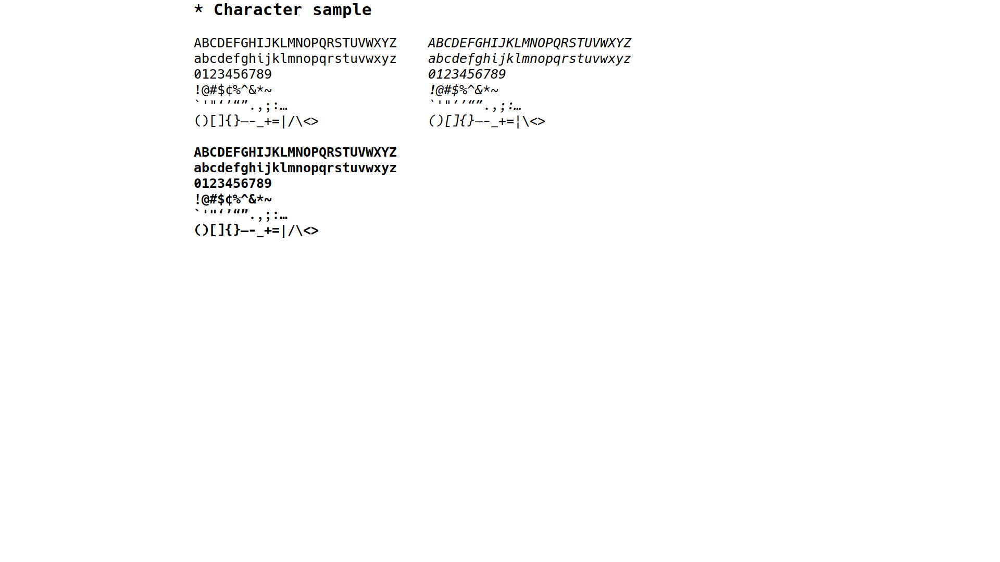
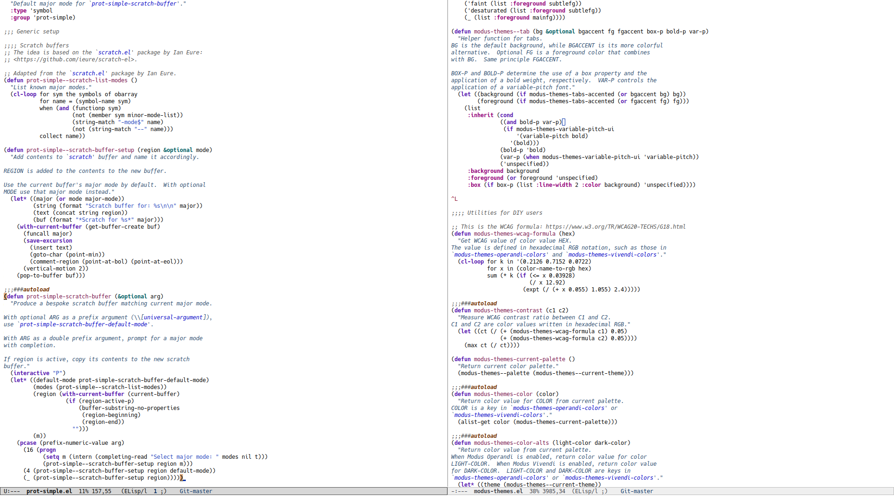
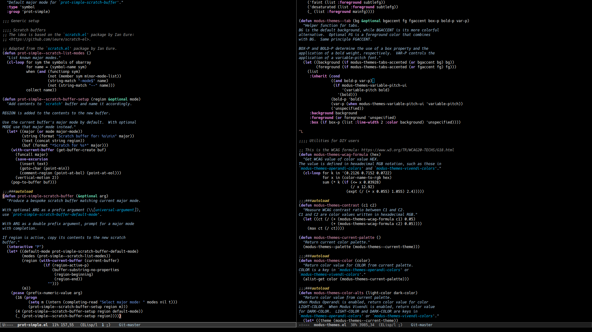

# Modified version of the "Hack" typeface

Last update: 2021-10-16.

* * *

This is the primary monospaced typeface I use in [my Emacs
setup](https://protesilaos.com/dotemacs).  It contains a set of glyphs
that slightly differentiate it from the upstream distribution.  The
source of the patched glyphs is (1) version `3.000` of [upstream
Hack](https://github.com/source-foundry/Hack), (2) the [alt-hack
repository](https://github.com/source-foundry/alt-hack) provided by the
authors of Hack itself, (3) version `1.3` of upstream Hack.

Summary of my changes, done on 2021-10-16:

1. Build on top of the `dev` branch from upstream, commit `b4331b33e`.
2. Use the flatter `1` (one) from Hack version `3.000` for the regular
   and bold variants.  Its shape is less exaggerated than its
   counterpart in newer releases of Hack.  Italics and Bold italics
   still use the hooked version (the default).
3. Add a `0` (zero) with a forward slash from the alt-hack repo for all
   variants.
4. Change `f` (lower case F) to a knife variant for the italic and bold
   italic sets.  Keep it as-is for regular and bold.
5. Use the `a` that is present in version `1.3` of upstream Hack, as it
   has a more open shape at small font sizes.  Note that some accented
   combinations, such as `ã` (`a` with tilde) did not exist in version
   `1.3` so those retain the more closed shape of the latest version of
   Hack.

Here are screenshots with some real-world usage of the typeface at point
size 9 (view the images at their natural size, otherwise the text is
distorted):

## Copying

Shared under the same free/libre permissive terms as Hack (see COPYING).
