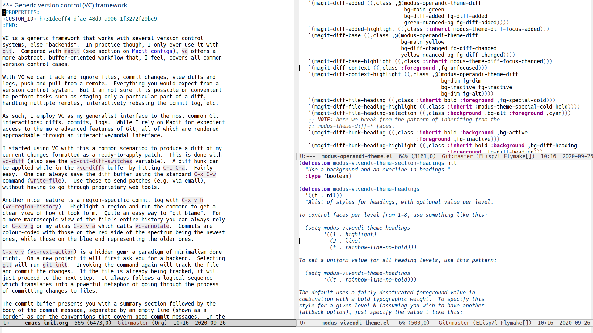

# Modified version of the "Hack" typeface

This is the primary monospaced typeface I use in [my Emacs
setup](https://protesilaos.com/dotemacs).  It contains a set of glyphs
that slightly differentiate it from the upstream distribution.  The
source of the patched glyphs is (1) version `3.000` of [upstream
Hack](https://github.com/source-foundry/Hack), and (2) the [alt-hack
repository](https://github.com/source-foundry/alt-hack) provided by the
authors of Hack itself.

Summary of my changes, done on 2020-09-26:

1. Build on top of the `dev` branch from upstream, commit `b4331b33e`.
2. Use the flatter `1` (one) from Hack version `3.000` for the regular
   and bold variants.  Its shape is less exaggerated than its
   counterpart in newer releases of Hack.  Italics and Bold italics
   still use the hooked version (the default).
3. Add a `0` (zero) with a diamond-shaped mid dot from the alt-hack repo
   for the regular and italic variants.  Bold and bold italics retain
   their default glyphs.
4. Change `f` (lower case F) to a knife variant for the bold and bold
   italic sets.  Keep it as-is for regular and italics.

Here is a screenshot with some real-world usage of the typeface at point
size 13:

## Copying

Shared under the same free/libre permissive terms as Hack (see COPYING).
